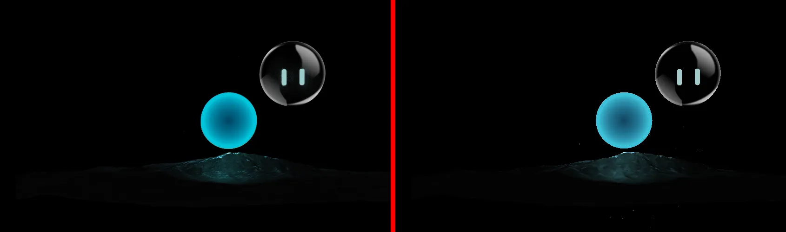
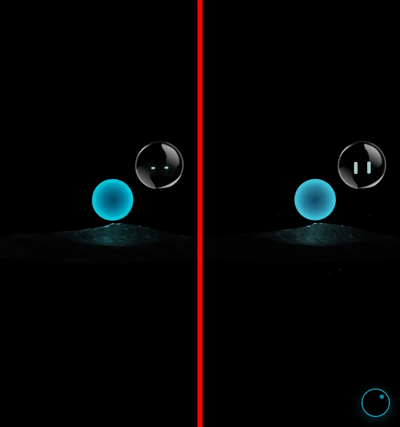
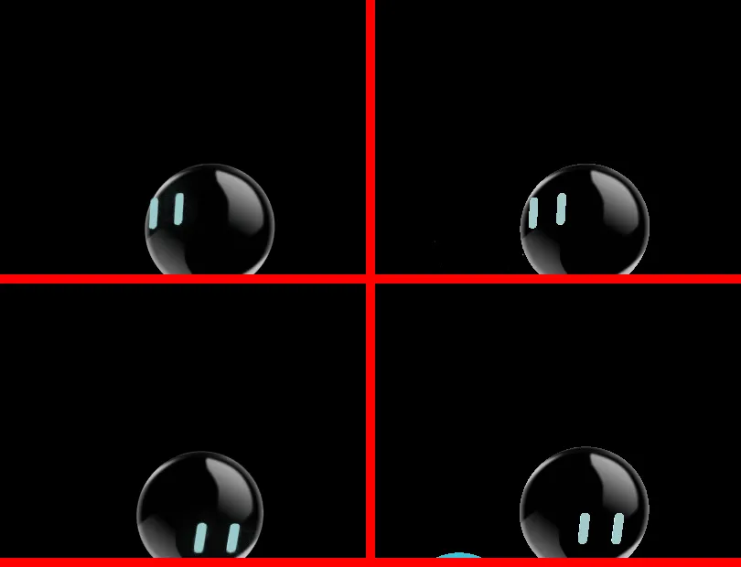

# Orb: Spline scene inventory and Three.js prototype

**Status (2026-10-02):** investigation + working prototype at `/lab/orb` (not linked, noindex, disallowed in robots.txt). **Decision: option A** (ADR-017): keep Spline and apply the scene checklist; the owner will report back after editing the scene so it can be re-measured. This document is the evidence for that decision (CLAUDE.md Phase 7: replace Spline only on evidence).

## 1. What the Spline scene contains

Extracted from the published scene (`prod.spline.design/mFnZxSV0j4KZp6WS/scene.splinecode`) by loading it with `@splinetool/runtime` in a test page and walking its object tree, material uniforms, events and compiled shaders.

### Objects

| Object | What it is | Geometry | Material (Spline layers, bottom → top) |
|---|---|---|---|
| **Glass Ball** (group) | the "face" orb | — | — |
| ↳ Clear Sphere | glass sphere, radius 75 (×2.5 group scale ×0.44) | sphere 64×64 (8,064 triangles) | Phong light 60% → **transmission** (thickness 20, IOR 5, roughness 1) → **matcap** (screen) → grey #bababa 27% (overlay) |
| ↳ Eyes → Rectangle 2 / 3 | two rounded bars | extrusions, 652 triangles each | flat #cefdfd, 20% Phong light |
| **mountain** | rocky terrain under the cyan orb | 10,441 triangles | colour #202020 → matcap (overlay 50%) → rock photo, triplanar (multiply 75%); physical light 65% (roughness 0.77); animated **noise displacement** (very small) |
| **Sphere** | the glowing cyan orb, radius 50 (×1.57) | sphere 64×64 (8,064 triangles) | blue #216bca 50% → cyan **fresnel** rim #47e3ff; Phong light (screen 28%); translucent |
| ↳ Particle Emitter | floating dust | instanced sprites | 10 per second, 4 s life, soft dots, deep blue ↔ white, in a sphere around the cyan orb |
| Point Light 2 | cyan-blue light behind the cyan orb | — | intensity 10, range 518, no shadow |
| **pl** | cyan light that **follows the cursor** | — | intensity 8, range 197, **casts shadows** (1024² cube map) |

Camera: perspective, FOV 45°, at (199, 85, 1188) aimed at (−50, 120, −13). Background black. Post-processing **off** (bloom, vignette etc. are all disabled). Textures: a 1024² matcap and a 1000×667 rock photo, both embedded in the scene file.

### Reactions (events)

| Event | Object | Behaviour | Works on the live page? |
|---|---|---|---|
| Start (loop) | Eyes | blink: squash to 15% height in 300 ms and back, every ~2.6 s | ✅ |
| Start (loop) | Sphere | 10 s ping-pong: floats up 104 units and back, colour shifts slightly bluer↔cyan | ✅ |
| Look At (cursor) | Glass Ball | the face turns to follow the cursor; resets when the pointer leaves | ✅ |
| Follow (cursor) | pl | the cyan light moves with the cursor (lights the mountain where you point) | ✅ |
| Scroll | Glass Ball | glide to the left over 400 px of scroll | ❌ never fires: the canvas is `position: fixed`, so its own scroll position never changes |
| Drag & drop | Glass Ball | drag the ball, it springs back | ❌ page content covers the canvas, so the ball can't be grabbed (tested) |
| Orbit "hover rotate" | camera | ±10° camera sway with the pointer | ❌ no visible movement (measured) |
| Follow (cursor) | Glass Ball | — | disabled in the file |

### Renderer facts that matter for a rebuild

- Spline's runtime is a fork of **Three.js**: the shaders are Three.js' Blinn-Phong / physical lighting plus Spline's layer blending (normal, multiply, screen, overlay).
- **Colours are raw values and reach the screen without sRGB encoding.** Materials write linear values and the final copy pass doesn't convert them. Using normal Three.js colour management makes everything paler.
- **Lights use Three.js' legacy falloff** (linear to the light's range), much brighter than today's physically based falloff at these distances.
- Shadows: basic (hard) shadow map.

## 2. Where the frame cost goes (Spline)

Per frame at 1440×900, 2× density: 51 draw calls, ~320,000 triangles, 17 shader programs.

1. **The cursor-following light's shadow:** a 6-face 1024² cube shadow map is re-rendered every frame (the light moves). That's ~25 extra draw calls of the mountain and spheres.
2. **Glass transmission:** the scene is rendered again into full-resolution buffers so the glass can blur what's behind it, which is black.
3. Continuous animation (float, blink, particles) means the scene never idles.

**The shadow is invisible.** In the prototype, frames with and without it differ by 0.02–0.03/255 on average (only particles differ), while the shadow makes each frame ~3× more expensive. The light's range (197) doesn't reach the glass ball, and the shadows it could cast fall on the mountain's dark top.

## 3. The prototype (`/lab/orb`)

`components/lab/ThreeOrb.tsx` + assets in `public/lab/orb/` (geometry, matcap, rock texture, parameters). It reproduces:

- the same camera, transforms and geometry (exported from the scene);
- each material's layer stack, using Spline's own blend formulas on Three.js lighting, with raw colours, linear output and legacy light falloff;
- blink, float + colour breathing, face look-at, cursor light, particles;
- the same fixed layer and CSS as the live orb, so screenshots line up.

**Left out on purpose:** the scroll, drag and hover-rotate reactions (they don't work on the live page), the shadow (invisible, expensive) and transmission (it blurs a black background, so it's treated as black).

URL options: `?engine=spline|three`, `&variant=home`, `&shadows=1`, `&t=5.2` (freeze the animation clock for screenshots).

### Fidelity

- Positions and sizes: identical at 1440 and 390 px (same camera, same geometry).
- Cyan orb: green and blue channels within ~3/255 of Spline from centre to rim. Spline shows **no red at all** in the orb, while the prototype has 18–60/255 red, so its rim looks slightly paler. The cause isn't found yet; this is the main open fidelity item.
- Glass ball, eyes, mountain lighting (including the cyan glow on the peak) and particles: visually matching.
- Eye tracking: same direction and similar strength; Spline turns slightly further toward the top-left.
- Not implemented: the mountain's tiny animated noise displacement (intensity 0.01; not visible at this size).

### Cost (same lab page, same machine, software WebGL)

| | Spline | Three.js prototype |
|---|---|---|
| Orb download (compressed) | ~1,020 KB: runtime ~700 + scene 225 + decoder 85 + poster 13 | ~420 KB: Three.js 182 + geometry 160 + textures 73 |
| Lighthouse mobile TBT (lab page) | 7.2–8.8 s | 2.1–2.3 s |
| Shader programs | 17 | 5 |
| Draw calls / triangles per frame | 51 / ~320,000 | 6 / ~28,000 |
| Frame rate in software rendering (proxy for GPU load) | ~0.8 fps | ~12 fps |

The geometry file can shrink to ~80 KB (16-bit positions); it's also served uncompressed today.

## 4. Options

| | A. Keep Spline, fix the scene | B. Switch to the Three.js version |
|---|---|---|
| What | In the Spline editor: turn off the "pl" light's shadows, replace the glass transmission with a plain dark layer, then re-publish | Polish the prototype (red-channel match, geometry compression), then swap it in behind the existing poster/pause logic |
| Visual fidelity | identical (it's the same file) | near-identical; one known colour nuance |
| Interaction | unchanged | same visible behaviour (blink, float, look-at, cursor light) |
| Frame cost | big drop (shadow and transmission are the two biggest passes) | lowest (~14× less work than today) |
| Start-up / download | unchanged runtime: ~1 MB, 17 shaders | ~60% less download, ~70% less blocking time |
| Editing | keep designing in Spline | changes are code (colours and timings are simple constants) |
| Effort | ~15 minutes in Spline | ~1 day to finish and integrate |
| Risk | none | small: new code path, kept behind the same poster and error handling |

**Recommendation:** do A now; it's free and keeps the editor. B is the clear winner on performance and is proven feasible. Choose it if the orb's look is considered final, or if the start-up cost after A is still too high. Either way the poster, deferred loading and pausing stay.

## 5. How the data was extracted (for re-checks)

1. Serve a blank page that imports `@splinetool/runtime` from `node_modules`, then `new Application(canvas).load(sceneUrl)`.
2. In the browser: `app.getAllObjects()`, `app.getSplineEvents()`, `app._data` (scene JSON: materials, events, states, lights), `app._scene.traverse(...)` (Three.js objects: `matrixWorld`, `geometry.attributes`, `material.uniforms`), `app._renderer` (colour space, tone mapping, shadow type).
3. Shader sources: wrap `WebGLRenderingContext.prototype.shaderSource` before loading.
4. Geometry was packed as Float32 positions + Int8 normals + Uint16 indices; textures saved via canvas and converted to WebP.

`_data`, `_scene` and `_renderer` are private runtime fields: they work with runtime 2.0.61 but may change in other versions.
